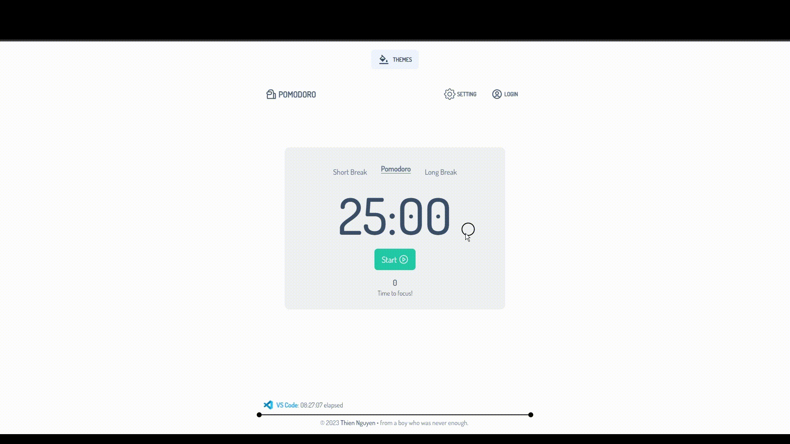

<div align="center">


[pomodoro-re.vercel.app](https://pomodoro-re.vercel.app/), Re-imagine Pomodoro in my own way<br>
Using Next.js 13, enhanced with Tailwind, theme custom with daisyUI, powered by TypeScript, and seamlessly deployed via Vercel.

[](https://www.codefactor.io/repository/github/thienguen/pomodoro-re)

</div>

# Preview ☁️

<div align="center">



</div>

## Getting Started 🎲


Set up the environment variables file with the following variables. (Optional)

```bash
  git clone https://github.com/Thienguen/pomodoro-re.git

  # create .env file

  NEXT_PUBLIC_DISCORD_ID=
  NEXT_PUBLIC_EMAIL=
```

### Next, run in the CLI (root folder) ☢️

```bash
  # install dependencies
  npm install

  # run the development server
  npm run dev
  # or
  yarn dev
  # or
  pnpm dev
```

Open [http://localhost:3000](http://localhost:3000) with your browser to see the result.

# Features ✒️

- [x] Discord Presence
- [x] useSound
- [x] Theme options
- [x] Reponsive (??)

# Project Folder Structure 💀

Welcome to the project's folder structure! Below is an organized representation of the directories and subdirectories:

```bash
## public
├── 📂 fav
├── 📂 icons
├── 📂 preview
└── 📂 sounds

## src code
├── 📁 app
│   └── 📄 layout.tsx
│   └── 📄 page.tsx
├── 📁 components
│   ├── 📁 footer
│   │   └── 📁 lanyard
│   │   └── 📄 index
│   ├── 📁 header
│   │   └── 📁 left-right
│   │   └── 📁 menu
│   │   └── 📁 modal
│   │   └── 📄 index
│   ├── 📁 home
│   │   └── 📄 index
│   ├── 📁 provider
│   │   └── 📄 ContextProvider.tsx
│   ├── 📁 setting
│   │   └── 📄 index
│   ├── 📁 ui
│   │   └── 📁 themes
├── 📁 hooks
│   └── 📁 pomodoro
│   └── 📄 useXXX.ts 
└── 📁 lib
    ├── 📁 type
    └── 📁 util

## css
├── 📁 styles
│   ├── 📄 global.css
│   └── 📄 cursor.css
```

# Tech Stack

- [Next.js](https://nextjs.org/)
- [React.js](https://reactjs.org/)
- [Tailwind CSS](https://tailwindcss.com/)
- [DaisyUI](https://daisyui.com/)

# 📈 Statistic

<div align="center">


</div>

# Issues 🧻

The repo currently facing two known bugs from Next.js

- [ ] [Server run out of memory](https://github.com/vercel/next.js/issues/46756)
- [ ] [Non Post Server Error](https://github.com/vercel/next.js/issues/53882)

# Aight 🐧

- I still having the original Pomodoro before the current one, not sure what happened?
- Was intended to do a reverse-engineer, turns to re-imagine.
- Project was done in: 20 hours
- it turns out, aight.
- Heavily inspired by [Pomofocus](https://pomofocus.io/) and [JoseMurlloc](https://github.com/JoseMurilloc/clone-pomofocus)

# 📝 License & Forking/Cloning

All code in this repository is licensed under the GNU Affero General Public License v3—see the LICENSE file for more information. Please remove all of my personal information and related stuff. If you want to use this repo. This is source-available. Feels free to do so and give it a star.
